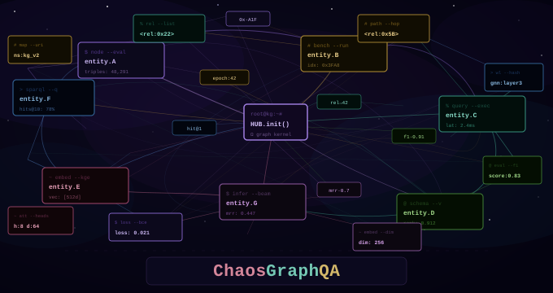
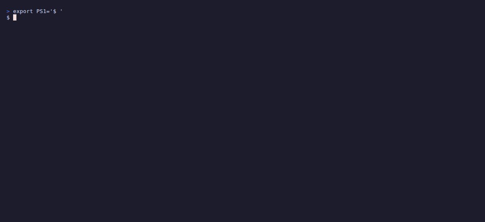
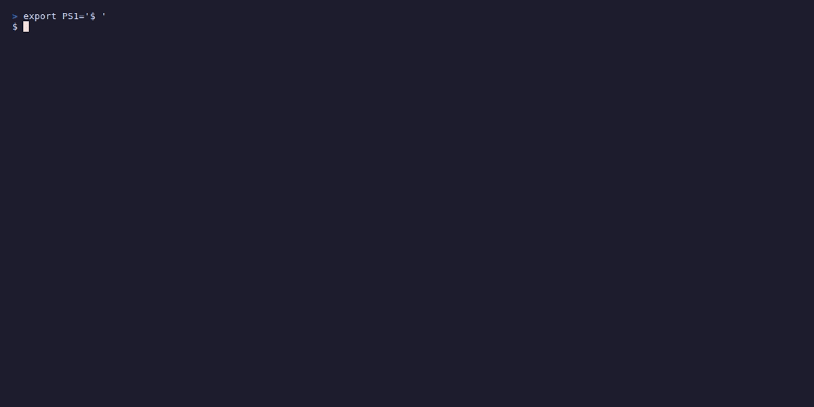

# ChaosGraphQA



[](https://github.com/teragonia/ChaosGraphQA/actions/workflows/ci.yml)
[](https://www.python.org/downloads/)
[](https://opensource.org/licenses/MIT)

A benchmark for LLM reasoning that generates unique knowledge graphs on every run — no static datasets, no memorization, no gaming.

Each run produces a random graph, derives ground truth algorithmically via BFS/DFS and cycle detection, and scores model answers against that truth. Same seed → same graph; different seed → different graph.

## Demo

**Generate a benchmark** (no API key needed):



**Evaluate a model** against the generated benchmark:



> To record GIFs locally, install [VHS](https://github.com/charmbracelet/vhs) and run `vhs assets/tapes/generate.tape`.

## Install

```bash
pip install -e .                    # minimal
pip install -e .[dev,viz,llm]       # everything
```

Set API keys for whichever providers you want to use:

```bash
export OPENAI_API_KEY="..."
export ANTHROPIC_API_KEY="..."
export GOOGLE_API_KEY="..."
export HF_TOKEN="..."
```

## Usage

### CLI

```bash
# Generate a benchmark
cgqa generate --generator-type multihop --complexity 2 --num-questions 10 --output benchmark.json
cgqa generate --generator-type hierarchical --complexity 3 --num-questions 5 --seed 42
cgqa generate --generator-type temporal --complexity 1 --num-questions 8 --verify

# Inspect and evaluate
cgqa info benchmark.json
cgqa list-models
cgqa evaluate benchmark.json --model anthropic/claude-3.7-sonnet --output results.json
cgqa evaluate benchmark.json --model openai/gpt-4o-mini --temperature 0.1 --batch-size 5

# Manage outputs
cgqa init-structure
cgqa list-files
cgqa analyze results.json
cgqa cleanup
```

Run the full leaderboard across all models and reasoning types:

```bash
cgqa_bm
```

### Python API

```python
from cgqa.generators import MultiHopGenerator, HierarchicalGenerator
from cgqa.questions import QuestionGenerator
from cgqa.models.question import QuestionType
from cgqa.llm.evaluation.llm_evaluator import LLMEvaluator

gen = HierarchicalGenerator(complexity_level=3, seed=42)
kg = gen.generate()

question_gen = QuestionGenerator(seed=42)
questions = question_gen.generate_questions(
    kg,
    question_types=[QuestionType.HIERARCHICAL],
    num_questions_per_type=5,
)

evaluator = LLMEvaluator.from_model_string("anthropic/claude-3.7-sonnet")
summary = evaluator.evaluate_questions(questions.questions, kg)
print(f"Accuracy: {summary.accuracy:.1%}  |  Tokens: {summary.total_tokens_used:,}")
```

### Configuration file

YAML configs live in `configs/llm/` and let you pin temperature, rate limits, etc.:

```yaml
provider_name: "openai"
model_name: "gpt-4o-mini"
api_key: "${OPENAI_API_KEY}"
temperature: 0.1
max_tokens: 1000
rate_limit_delay: 0.1
```

## Supported Models

| Provider | Models |
|---|---|
| OpenAI | `gpt-4o`, `gpt-4o-mini`, `gpt-4.1`, `o3`, `o4-mini`, `gpt-5` family |
| Anthropic | `claude-3.7-sonnet`, `claude-3.5-haiku`, `claude-4-sonnet`, `claude-4.5-*` |
| Google | `gemini-2.5-pro`, `gemini-2.5-flash`, `gemini-2.0-flash` |
| HuggingFace | Any model, e.g. `HuggingFaceTB/SmolLM3-3B` |

Run `cgqa list-models` to see availability based on installed packages.

## Reasoning Types

| Type | What it tests |
|---|---|
| `multihop` | Path traversal 2–6 hops, shortest-path queries |
| `hierarchical` | Taxonomy inheritance, `is_a` / `part_of` chains |
| `temporal` | Event ordering, causal chains, duration reasoning |
| `weighted` | Confidence-weighted paths, probabilistic filtering |
| `conflicting` | Contradiction detection, inconsistency classification |

All five types scale across complexity levels 1–4 (5 to 200 nodes).

## Benchmark Results

13 models evaluated across 780 runs. Top performers:

| Model | Accuracy |
|---|---|
| Gemini 3 Pro Preview | 90.6% |
| Claude Sonnet 4.5 | 88.7% |
| Gemini 3 Flash Preview | 88.4% |

Full results: [BENCHMARK_RESULTS.md](BENCHMARK_RESULTS.md)

## Output Structure

```
cgqa_outputs/
├── benchmarks/       # generated graphs, by type and complexity
├── evaluations/      # per-model results
├── analysis/         # reports
├── logs/
└── temp/             # auto-cleaned
```

## Contributing

See [CONTRIBUTING.md](CONTRIBUTING.md) for dev setup, testing, and PR guidelines.

## Security

To report a vulnerability privately, see [SECURITY.md](SECURITY.md).

## Code of Conduct

This project follows the [Contributor Covenant](CODE_OF_CONDUCT.md).

## License

MIT — see [LICENSE](LICENSE).
